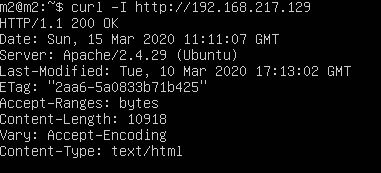

# Práctica 1

Raúl Sánchez Fernández

## Virtualización e instalación

Para esta primera práctica se ha utilizado la 18.04 de Ubuntu Server. Se ha virtualizado sobre VMWare ya que facilita ucho más la configuración de red en NAT. 

La primera  máquina instalada se ha configurado con el nombre de m1 y el usuario m1. Tras la instalación se ha clonado la máquina usando ovftools y se ha cambiado el nombre del equipo y del usuario a m2 para ambos. De esta forma tenemos dos máquinas recien instaladas ahorrando el tiempo de instalación de una de ellas.

Ambas máquinas están configuradas en NAT. VMware utiliza la misma NAT por defecto para las máquinas que usan esta configuración y además crea una interfaz virtual en el host que actúa como gateway. De esta forma no se necesita configuración adicional ni en el host ni en las máquinas virtuales, teniendo ping desde el principio.

Podemos ver que ambas máquinas se encuentran en la misma subred:

Además, podemos ver cómo el host tiene interfaz virtual que corresponde al gateway:

## Instalación de LAMP stack

Para instalar LAMP se ha usado en las dos máquinas

`sudo apt install apache2 mysql-server mysql-client`

Aunque apache2 ya está instalado por defecto en esta release de Ubuntu server. De hecho, el servicio se levanta automáticamente por defecto. Podemos comprobar que funciona:

Además, podemos probar a hacer curl de una máquina a otra.

De m1 a m2:

De m2 a m1:

## Conexión por SSH

El servidor SSH viene configurado por defecto para poder acceder por contraseña, por lo tanto se puede utilizar por defecto sin tener que configurar nada más. Lo podemos comprobar:

De m1 a m2:

De m2 a m1:

